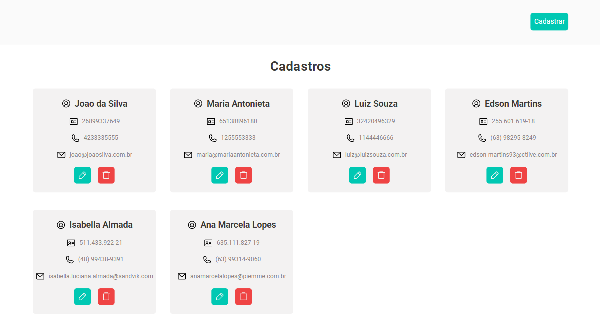
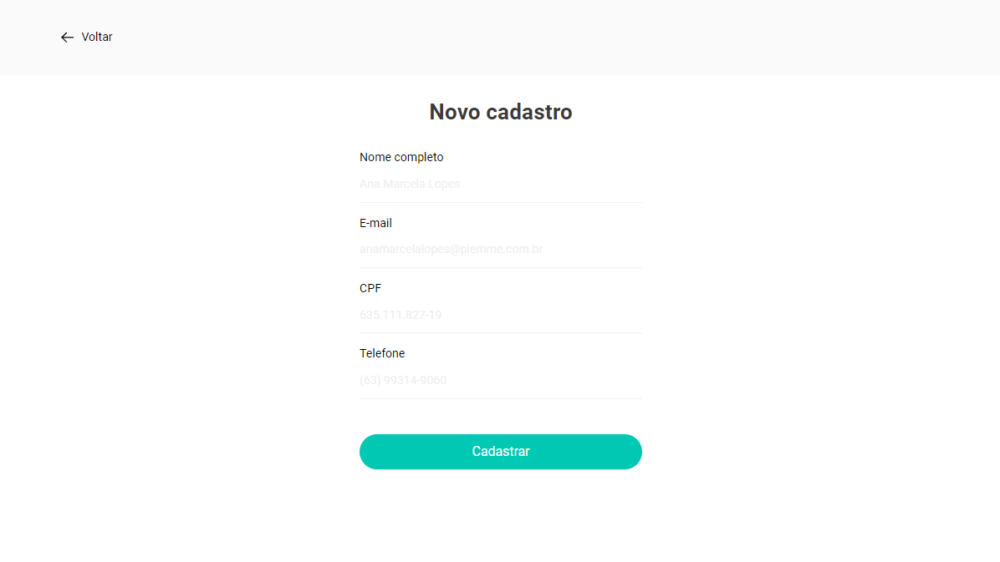

<div align="center" >
  
</div>
<br>

<div align="center" >
  
</div>
<br>
<br>

## 🛠 Tecnologias

Esse projeto foi desenvolvido com as seguintes tecnologias:

- HTML
- CSS
- Typescript
- React
- Vite
- Styled Components
- Immer
- Zod
- Tailwindcss

## 📜 Projeto

Uma aplicação React utilizando o Vite, que foi desenvolvida para estudar sobre os fundamentos do ReactJS, utilizando conceitos como ContextAPI, useReducer, immer, Local Storage e roteamento.

### 📚 Pré-requisitos

Antes de começar, você vai precisar ter instalado em sua máquina as seguintes ferramentas:
[Git](https://git-scm.com), [Node.js](https://nodejs.org/en/).
Além disto é bom ter um editor para trabalhar com o código como [VSCode](https://code.visualstudio.com/)

### ⚙️ Rodando o Web

```bash
# Clone este repositório
$ git clone https://github.com/Brenerr/cadastro-usuarios

# Acesse a pasta do projeto no terminal/cmd
$ cd cadastro-usuarios

# Instale as dependências
$ npm install

# Execute a aplicação em modo de desenvolvimento
$ npm run dev
```
